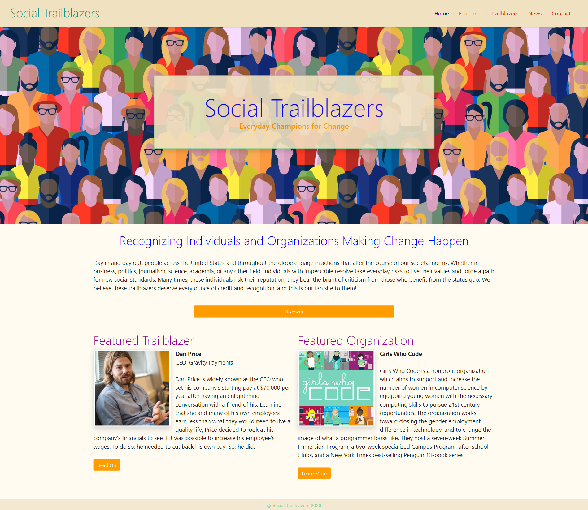

# Social Trailblazers

## Description

This website began as an optional holiday assignment for a coding boot camp to gain practice working with Bootstrap, HTML, and CSS. The prompt was to create a fan site, the topic of which was our own choosing. Although I enjoy fictional entertainment, I thought I would take it more in the direction of a fan site for notable individuals and organizations actively involve with practicing change and impacting our societal norms. 

The site is comprised of a Features page, which highlights one Individual Trailblazer and one Organizational Trailblazer; a Trailblazers page with cards of other trailblazers who have been featured; a News page of relevant news about the individuals and organizations; and a Contact page to submit general comments or suggestions for future featured trailblazers. 

As this is a boot camp project, some features on the site are non-functioning. The pagination on the Trailblazers and News pages do not direct to any other pages, and the contact form does not submit comments. 

## Link to Website

[Social Trailblazers Website](https://mradamhorn.github.io/social-trailblazers/index.html)

## Screenshot of Home Page

